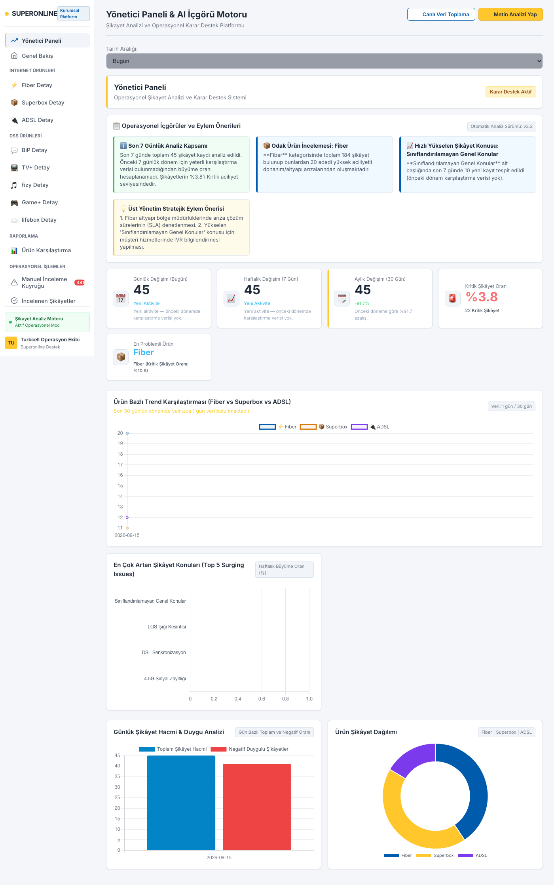
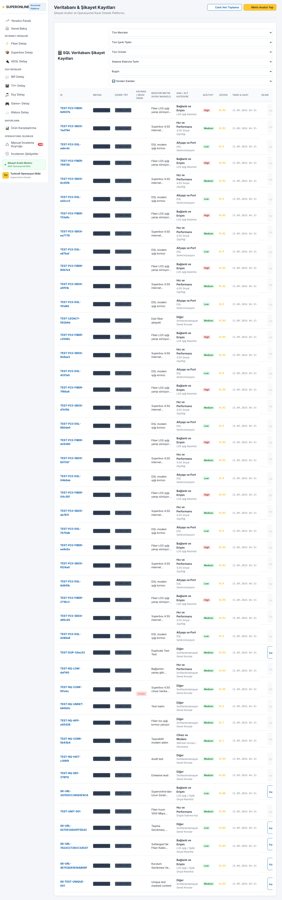
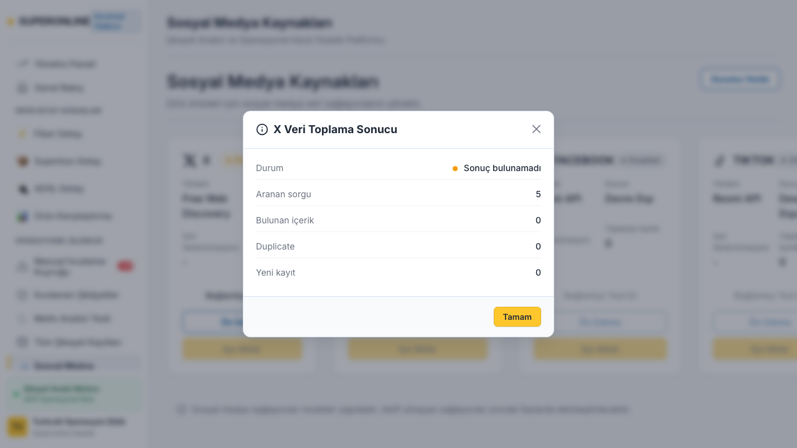

# 🚀 Turkcell Superonline AI Complaint Intelligence Platform

<p align="center">
  
  
  
  
  
</p>

> **Kurumsal Müşteri Deneyimi, AI Destekli Ürün & Duygu Analizi, Otomatik Veri Toplama (Scraping) ve C-Level Yönetici Analiz Platformu**

Turkcell Superonline müşteri geri bildirimlerini ve kamuya açık müşteri şikâyetlerini otomatik toplayıp işleyen bu platform; **Fiber**, **ADSL**, **Superbox**, **TV+**, **BiP** vb. ürün grupları bazında AI sınıflandırma, duygu (sentiment) tespiti, aciliyet derecelendirmesi ve çoklu ürün çelişki analizleri gerçekleştirir.

---

## 📸 Ekran Görüntüleri (Visual Showcase)

### 📊 1. C-Level Yönetici Paneli (Executive Dashboard)
Dönemsel büyüme oranları, en çok ivme kazanan şikayet başlıkları (*Surging Issues*), NLP motoru risk uyarıları ve zaman serisi analitiği.



---

### 📈 2. Genel Operasyonel Durum ve KPI Paneli
Toplam şikayet hacmi, ürün bazlı dağılım (Fiber, Superbox, ADSL), konu kategorizasyonu ve canlı sistem istatistikleri.


---

### 🔍 3. Fiber & Ürün Analitiği Filtreleme
Ürün bazında filtrelenmiş detaylı şikayet listesi, trend grafikler ve konu bazlı dağılım kartları.



---

### 💡 4. Detaylı Şikayet & AI İçgörü Modalı
Şikayet metni, AI tarafından önerilen aksiyonlar, duygu puanı, kök neden analizi ve doğrudan yanıt şablonu önerileri.



---

## 🔥 Temel Özellikler

| Özellik | Açıklama |
| :--- | :--- |
| **🤖 Ürün & Duygu Sınıflandırması** | Hibrid Kural Motoru + NLP Bağlam Analizi ile %95+ doğruluk oranı. |
| **🔄 Çift Modlu Tarayıcı (Scraper)** | **INCREMENTAL** (Güncel 1. sayfa şikayetleri) & **BACKFILL** (Checkpoint'li geçmiş veri tamamlama). |
| **⚖️ Operatör İnceleme Kuyruğu** | Düşük güven puanlı veya çelişkili kayıtlar için insan onaylı (*Human-in-the-loop*) doğrulama. |
| **🔍 Scrape Run Detay Raporu** | HTTP durum kodları, benzersiz URL'ler, DB duplicate sebepleri ve tarama durma nedenleri izleme. |
| **📈 C-Level Yönetici Paneli** | Günlük/haftalık/aylık artış oranları, trend analitiği ve AI stratejik eylem önerileri. |
| **🎨 Modern Dark Mode & Glassmorphism UI** | Vanilla JS + Glassmorphism CSS ile yüksek performanslı SPA arayüzü. |

---

## 🏗️ Proje Mimarisi & Dizin Yapısı

```
.
├── server.py                   # Python REST API Sunucusu (http.server / Custom Router)
├── nlp_engine.py               # AI & NLP Sınıflandırma, Duygu & Kök Neden Analiz Motoru
├── database.py                 # SQLite/PostgreSQL Veritabanı Migration & İnceleme Yönetimi
├── scraper.py                  # HTTP Resilient Multi-strategy Scraping Motoru
├── app.js                      # Vanilla JS SPA (Single Page Application) Mantığı
├── index.html                  # Responsive UI HTML5 Yapısı
├── styles.css                  # Custom Dark Mode & Glassmorphic CSS Tasarım Sistemi
├── assets/images/              # Proje ekran görüntüleri & görsel varlıklar
├── Dockerfile                  # Container imaj yapılandırması
├── docker-compose.yml          # App & Database container orchestration
├── requirements.txt            # Python bağımlılık listesi
└── run.sh                      # Tek tıkla uygulamayı başlatma betiği
```

---

## ⚙️ Hızlı Başlangıç (Quick Start)

### 1. Yerel Kurulum (Python)

```bash
# Bağımlılıkları yükleyin
pip install -r requirements.txt

# Uygulama sunucusunu başlatın (Port: 8080)
python3 server.py
# veya
bash run.sh
```

Uygulama çalıştıktan sonra tarayıcınızdan `http://localhost:8080` adresine erişebilirsiniz.

### 2. Docker ile Çalıştırma

```bash
# Container'ı derleyin ve başlatın
docker-compose up -d --build
```

---

## 🌐 Ortam Değişkenleri (.env)

Proje varsayılan ayarları `.env.example` dosyasında mevcuttur:

| Değişken | Açıklama | Varsayılan |
| :--- | :--- | :--- |
| `APP_ENV` | Çalışma ortamı (`development` / `production`) | `development` |
| `APP_PORT` | HTTP Port numarası | `8080` |
| `DB_TYPE` | Veritabanı türü (`sqlite` / `postgres`) | `sqlite` |
| `DATABASE_PATH` | SQLite veritabanı dosya yolu | `superonline_enterprise.db` |
| `ENABLE_PUBLIC_WEB_PROTOTYPE` | Canlı web analiz sekmesi izni | `false` |
| `OPENAI_API_KEY` | Opsiyonel LLM Bağlam Analizi API Key | `-` |

---

## 🔌 REST API Endpoints

- `GET /api/v1/stats`: Genel KPI istatistikleri ve ürün dağılımları.
- `GET /api/v1/complaints`: Filtrelenebilir ve sayfalanabilir şikâyet listesi.
- `POST /api/v1/prototype-scrape`: Asenkron tarama (scraper) başlatma endpoint'i.
- `GET /api/v1/scrape-runs/{run_id}`: Tarama detay raporu ve sayfa bazlı URL metrikleri.
- `GET /api/v1/review-queue`: İnceleme bekleyen şikâyet kayıtları.
- `POST /api/v1/review-queue/{id}/approve`: AI kararını onaylama.
- `POST /api/v1/review-queue/{id}/correct`: Manuel ürün düzeltme.
- `POST /api/v1/analyze`: Metin bazlı canlı AI sınıflandırma ve bağlam analizi.
- `GET /api/v1/executive/summary`: Yönetici Paneli dönemsel büyüme ve AI içgörü özeti.
- `GET /api/v1/executive/trends`: 30 günlük zaman serisi trend verileri.

---

## 🧪 Test Komutları

```bash
# E2E Tarama ve Sayfalama Testi
python3 test_e2e_pagination.py

# Mod Bazlı Checkpoint & Incremental/Backfill Testi
python3 verify_modes_checkpoint.py

# AI Sınıflandırıcı Doğrulama Testi
python3 test_product_classifier.py
```

---

## 🚨 Yasal & Teknik Açıklamalar (KVKK & PoC Kapsamı)

1. **PoC (Proof of Concept) Amacı**: Web Scraper modülü yalnızca konsept kanıtlama amacıyla geliştirilmiştir. Şikayetvar vb. platformlardan çekilen veriler örnek niteliğindedir.
2. **Üretim Ortamı Entegrasyonu**: Üretim ortamında veri toplamak için Turkcell Superonline kurumsal CRM, Çağrı Merkezi (IVR), Mobil Uygulama Geri Bildirim API'leri kullanılmalıdır.
3. **KVKK & Veri Gizliliği**: GitHub deposuna gerçek müşteri kişisel verileri (PII), API anahtarları veya oturum verileri yüklenmemektedir.

---

## 📄 Lisans

MIT License © 2026 Turkcell Superonline Enterprise Team
